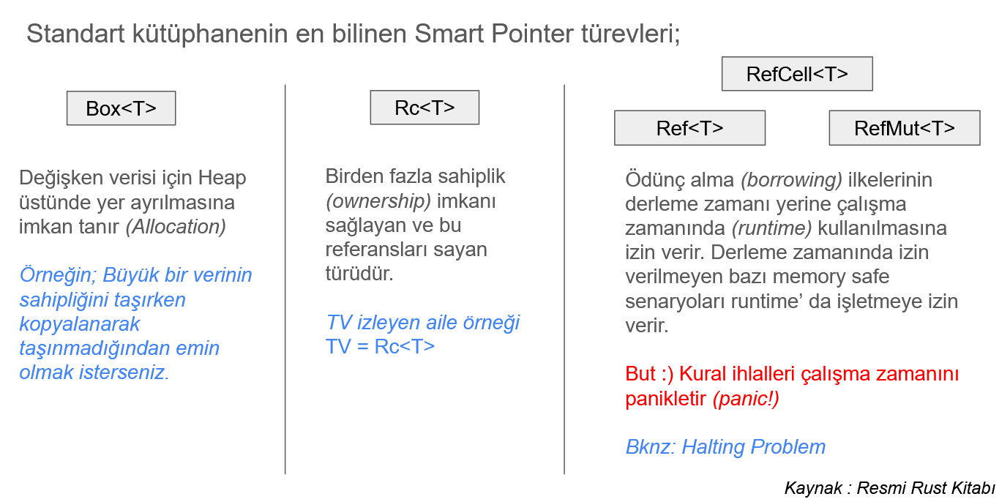

# Ders 10: Smart Pointers

Verinin bellekteki temsili sırasında şartlara göre farklı senaryolar için farklı enstrümanlar kullanılabilir. Bu nedenle
**Smart Pointer** türlerini bilmek önemlidir. Rust dilinde birçok smart pointer bulunur. Box, RefCell, Rc, Arc gibi Çoğu
durumda derleme zamanında verinin nerede tutulacağı ve ne kadar yer kaplayacağına dair Rust'ın öngörüleri vardır. Bazı
hallerde Stack odaklı verilerin kasıtlı olarak heap'e alınması istenebilir ya da heap'te yer alan verinin farklı
thread'ler tarafından güvenli bir şekilde kullanılabilmesi ve üstelik mutable olarak ele alınması da gerekebilir. Aynı
veriye birden fazla sahipliğin gelebilme ihtimali ve ek olarak mutable erişim ihtiyaçları akıllı işaretçiler tarafından
daha kolay yönetilebilir.

- **Pointer**
    - Bellek üzerindeki bir veri içeriğini işaret eden adres bilgisini taşıyan değişken olarak düşünülebilir.
    - Farkında olmadan şu ana kadar kullandığımız bir pointer vardır **(&)** ve veriyi referans etmekte kullanılır.
- **Smart Pointer**
    - **Pointer** adreslerine ek metadata bilgileri veya kabiliyetler ekler. Rust diline özel bir kavram değildir
      ve **C++** orijinlidir.
    - Referanslar veriyi işaret ederken Smart Pointer’ lar genellikle sahipliği _(Ownership)_ de alır. **String** ve
      **Vec<T>** türleri smart pointer olarak da geçerler, zira belli bir bellek adresindeki verinin sahipliğini
      alırlar ve onu değiştirmemize izin verirler.
    - **Deref** ve **Drop** trait’lerini implemente eden veri yapıları olarak da tasarlanabilirler _(Yani kendi Smart
      Pointer modellerimizi tasarlayabiliriz)_

## Boxing

Bir veriyi **Stack** yerine **Heap** üzerinde konuşlandırmanın en basit hali generic **Box** türevini kullanmaktır.
Aşağıda bu kullanıma ait basit bir fonksiyon yer almaktadır.

```rust
pub fn simple_boxing() {
    let value = 23;
    let boxed_value = Box::new(value);
    println!("Boxed value is {}", boxed_value);

    let identity = ("John Smith", 23, true);
    let boxed_identity = Box::new(identity);
    println!("Boxed identity is {:?}", boxed_identity);
}
```

**value** isimli değişken sayısal bir değerdir ve normal şartarda **Stack**'te tutulur. **Box** ile söz konusu değişken
verisi heap'e alınır ve stack'de onu işaret eden bir işaretçi bırakılır. Benzer bir kullanım şekli **Tuple** veri türü
içinde ele alınmıştır.

Box türünün kullanımı için sıkça vurgulanan senaryolardan birisi ağaç boğum modelleridir _(Tree Nodes)_ Aşağıdaki örnek
kod parçasını göz önüne alalım.

```rust
fn main() {
    recursive_data_model_with_error()
}
enum Tree {
    Node(i32, Tree, Tree),
    Empty,
}

pub fn recursive_data_model_with_error() {
    let left_child = Tree::Node(1, Tree::Empty, Tree::Empty);
    let right_child = Tree::Node(3, Tree::Empty, Tree::Empty);
    let root = Tree::Node(2, left_child, right_child);
}
```

Tree veri yapısı yine kendi türünden ikili dal şeklinde alt boğumlarını tutabilen bir veri yapısıdır. Lakin bu kod
parçası derlenmeyecektir ve şöyle bir hata mesajı alınacaktır.

```text
error[E0072]: recursive type `Tree` has infinite size
```

Bu senaryodaki gibi recursive veri modellerinde datanın ne kadar yer kaplayacağı derleme zamanında bilinemez. Senaryoda
**enum** türü kullanıldığı için de **stack** önceklikli bir yer ayırmas durumu söz konusudur. Ne kadar boyut
ayrılması gerektiğinin bilinmemesi taşma hatalarına _(Stack Overflow)_ sebebiyet verebilir. Bir düğüm kendisine referans
verdikçe bu sonsuz boyutlamaya doğru gidebilir. Dolayısıyla veriyi **Heap** üzerinde konuşlandırmak daha mantıklıdır.
Benzer bir senaryoyu bu sefer aşağıdaki kod parçasında olduğu gibi tasarlayarak devam edelim.

```rust
use std::fmt::{Display, Formatter};

enum Server {
    Node(String, Box<Server>, Box<Server>),
    Empty,
}
impl Display for Server {
    fn fmt(&self, f: &mut Formatter<'_>) -> std::fmt::Result {
        match self {
            Server::Node(name, primary, backup) => {
                write!(
                    f,
                    "Server: {}\n  Primary: {}\n  Backup: {}",
                    name, primary, backup
                )
            }
            Server::Empty => write!(f, "None"),
        }
    }
}

pub fn recursive_sample() {
    let backup_server_blue = Server::Node(
        String::from("Backup Server Blue"),
        Box::new(Server::Empty),
        Box::new(Server::Empty),
    );

    let primary_server_green = Server::Node(
        String::from("Primary Server Green"),
        Box::new(Server::Empty),
        Box::new(backup_server_blue),
    );

    let root_server = Server::Node(
        String::from("Root Server"),
        Box::new(primary_server_green),
        Box::new(Server::Node(
            String::from("Backup Root"),
            Box::new(Server::Empty),
            Box::new(Server::Empty),
        )),
    );

    println!("{}", root_server);
}
```

Server isimli **enum** türü, **Node** alanı içerisinde **Box** edilen kendi türlerini tutulmakta. Şirket sunucuları
arasındaki master-child ilişkileri tutmak için kullanılabilecek ilkel bir veri yapısı söz konusu. Server veri
yapısındaki node'lar Box edilerek tutulduğundan Heap alanında konuşlandırılacaklar. Dolayısıyla az önce karşılaşılan
hata ortadan kalkacak. Zira yine de temkinli olmakta fayda var. Veri modelinin kontrolsüz şekilde büyüme ihtimalini de
göz önüne almak gerekmekte. Bu açıdan bakıldığında yük testler, entegrasyon testleri gibi kontrol mekanizmaları ile kodu
kontrol etmek mühim.

# Reference Counting

Bilinçli bir şekilde **Heap** üzerine alınan verilerde birden fazla sahipliğin söz konusu olduğu durumlarda söz konusu
olabilir. Böyle bir senaryoda çalışma zamanının referansların hangi sırayla bellekten düşürüleceğini bilmesi de gerekir.
Buna özel yazılmış olan smart pointer türleri oluşturulan referanslası sayar ve eğer paylaşımlı thread'ler söz konusu
değilse **Rc** türü ihtiyacı karşılar. Birden fazla **thread'in** aynı veri alanı üzerinde çalışması gerektiği
durumlarda ise tip güvenliğini gözeten **Atomic Reference Counting** yani generic **Arc** türü kullanılır. Aşağıdaki kod
parçasında en basit haliyle generic **Rc** türünden bir smart pointer kullanımı işlenmektedir.

```rust
use std::rc::Rc;

fn main() {
    hello_rc()
}

pub fn hello_rc() {
    let p1 = Rc::new(String::from("Some values on the heap"));
    let p2 = p1.clone();
    let p3 = p2.clone();

    println!("p1={:?}", p1);
    println!("p2={:?}", p2);
    println!("p3={:?}", p3);
}
```

Bu örnekte yer alan p1, p2 ve p3 değişkenleri aynı string veriyi içeren işaretçilerdir. Senaryoyu biraz daha
zorlaştıralım.

```rust
fn main() {
    run_rc_with_error()
}

#[derive(Debug)]
struct Player {
    id: u32,
    name: String,
    friends: Vec<Player>,
}

impl Player {
    fn new(id: u32, name: &str) -> Self {
        Player {
            id,
            name: name.to_string(),
            friends: Vec::new(),
        }
    }

    fn add_friend(&mut self, friend: Player) {
        self.friends.push(friend);
    }

    fn print(&self) {
        println!("{}'s friends:", self.name);
        for friend in &self.friends {
            println!("  {} (ID: {})", friend.name, friend.id);
        }
    }
}

pub fn run_rc_with_error() {
    let mut steve = Player::new(1, "Stivi Vondır");
    let lord = Player::new(2, "Lord veyda");
    let anakin = Player::new(3, "Anakin");

    steve.add_friend(lord); // lord' un sahipliği add_friend sonrası steve' e taşındı
    steve.add_friend(anakin);

    steve.print();

    println!("Lord veyda's ID: {}", lord.id); // Value Moved Here
}
```

Bir oyuncunun arkadaşlarını da yine kendi türünden bir **Vector** üzerinde tutan **Player** isimli bir veri yapısı
mevcut. **add_friend** metodu ile bir oyuncuya başka **Player** örnekleri eklenebilmekte. Player türünden bir değişken
oluşturulduğunda ve add_friends ile kendi türünden bir değişken eklenmek istendiğin işler biraz karışır. Zira Player'ın
sahipliğini aldığı bir vector üzerinde değişiklik söz konusudur. Vector türü referans türevlidir. Temsili run metodu
çağırıldığında son satırda yer alan **println!** makro çağrısında **value moved here** hatası alınır. Bu son
derece doğaldır zira **steve** değişkeni üzerinden yapılan ilk **add_friend** çağrısı sırasında **lord** değişkeninin
sahipliği de bu metoda taşınır. Dolayısıyla **add_friend** sonrası **lord** değişkenine tekrardan erişilemez. _(Burada
klonlama gibi bir yöntemi deneyerek sonucun değişip değişmeyeceğini irdelemenizi öneririm_) Bu tip bir
senaryoyu yönetmek için **Rc smart pointer** kullanılabilir. Ancak **mutable** olma zorunluluğuna dikkat etmek gerekir.
Durumu daha iyi anlamak için örneği aşağıdaki gibi değiştirelim.

```rust
#[derive(Debug)]
struct Player {
    id: u32,
    name: String,
    friends: Vec<Rc<Player>>,
}

impl Player {
    fn new(id: u32, name: &str) -> Rc<Self> {
        Rc::new(Player {
            id,
            name: name.to_string(),
            friends: Vec::new(),
        })
    }

    fn add_friend(self: &Rc<Self>, friend: Rc<Player>) {
        self.friends.push(friend);
    }

    fn print(&self) {
        println!("{}'s friends:", self.name);
        for friend in self.friends.iter() {
            println!("  {} (ID: {})", friend.name, friend.id);
        }
    }
}

pub fn run_rc_with_error_2() {
    let steve = Player::new(1, "Stivi Vondır");
    let lord = Player::new(2, "Lord veyda");
    let anakin = Player::new(3, "Anakin");

    steve.add_friend(Rc::clone(&lord));
    steve.add_friend(Rc::clone(&anakin));

    steve.print();

    println!("Lord Veyda's ID: {}", lord.id);
}
```

Player veri yapısındaki friends isimli alanda Rc kullanılmıştır. Bu sayede Player değişkenlerinin referanslarının
sayılması ve dolayısıyla birden fazla sahipliğin mümkün kılınması hedeflenmektedir. Ancak bu kez de **add_friend**
metodu içerisindeki **self.friends.push** çağrımı bir hataya sebebiyet verir.

```text
cannot borrow data in an `Rc` as mutable [E0596]
cannot borrow as mutable
Help: trait `DerefMut` is required to modify through a dereference, but it is not implemented for `Rc<Player>`
```

Player veri yapısı kendi içinde kendi türünden bir Vector kullanmaktadır. İlk hata sebebiyle Vectörün **Rc<Player>**
şeklinde kullanılması tercih edilebilir. Ancak **add_friends** metodunda vektör içeriğine mutable olarak erişebilmemiz
de gerekmektedir ancak Rust sahiplik ilkeleri ve mutable kuralları buna müsaade etmez. Normalde bir veriye
birden fazla immutable erişim söz konusu olabilir. Böyle bir senaryoda tek bir kişiye mutable izni verilir. Ancak
Rust'ın bazı akıllı işaretçileri bu gibi durumları es geçerek kararın çalışma zamanı tarafından verilmesine olanak
sağlar. **RefCell** smart pointer kullanımı ile bu mümkündür. Yani ownership kontrolünün **runtime** tarafında
işletilmesi sağlanabilir. Buna göre örnek kodları aşağıdaki şekilde değiştirerek devam edebiliriz.

```rust
use std::cell::RefCell;
use std::rc::Rc;

fn main() {
    run_rc()
}

#[derive(Debug)]
struct Player {
    id: u32,
    name: String,
    friends: RefCell<Vec<Rc<Player>>>,
}

impl Player {
    fn new(id: u32, name: &str) -> Rc<Self> {
        Rc::new(Player {
            id,
            name: name.to_string(),
            friends: RefCell::new(Vec::new()),
        })
    }

    fn add_friend(self: &Rc<Self>, friend: Rc<Player>) {
        self.friends.borrow_mut().push(friend);
    }

    fn print(&self) {
        println!("{}'s friends:", self.name);
        for friend in self.friends.borrow().iter() {
            println!("  {} (ID: {})", friend.name, friend.id);
        }
    }
}

pub fn run_rc() {
    let steve = Player::new(1, "Stivi Vondır");
    let lord = Player::new(2, "Lord veyda");
    let anakin = Player::new(3, "Anakin");

    steve.add_friend(Rc::clone(&lord));
    steve.add_friend(Rc::clone(&anakin));

    steve.print();

    println!("Lord Veyda's ID: {}", lord.id);
}
```

İlk dikkat edilmesi gereken nokta **Player** veri yapısındaki **friends** alanının türüdür. **Player** nesneleri için
bir referans sayacı kullanılırken değiştirilebilir olmasını sağlama işi **RefCell** ile çalışma zamanına bırakılmıştır.
Bir Player değişkenini oluşturmayı kolaylaştıran **new** metodu _(C# tarafındakiler için Constructor)_ içerisinde
RefCell nesnesnin nasıl kullanıldığına da dikkat edelim. Ayrıca **friends** vektörünü üzerinde değişiklik yapmak
üzere kullanacaksak aynen **add_friend** metodunda olduğu gibi **borrow_mut** fonksiyonu ile mutable olarak ödünç
alınmasını sağlanmalıdır. Eğer sadece okuma amaçlı bir kullanım söz konusu ise borrow metodu kullanılmalıdır.

Bu senaryoya göre farklı kullanım şekilleri de söz konusu olabilir.

- Sadece bir vektör üzerinde çalışılacaksa **RefCell<Vec<Player>>** kullanımı yeterlidir.
- Vektörün paylaşımı söz konusu ise **Rc<RefCell<Vec<Player>>>** daha uygun bir çözüm olabilir.
- Hem vektörü hem de içindeki elemanların paylaşılması gerekiyorsa **Rc<Vec<RefCell<Player>>>**
  daha iyi bir çözüm olabilir.

Unutmamamak gerekir ki gerek **Rc** gerek **RefCell** kullanımlarının çalışma zamanı maliyetleri daha yüksektir _(Zira
referans sayımı ve mutasyon kontrolleri yapılmaktadır)_

Buraya kadar gördüğümüz Smart Pointer türlerini aşağıdaki grafikle özetleyebiliriz.



## Atomic Reference Counting

Referans sayımları için Rc kullanımı yeterlidir ancak veriye farklı thread'lerden erişim söz konusu ise generic Arc türü
ve kilitleme _(locking)_ mekanizmaları ele alınmalıdır.

// Thread'lerin işlendiği bölümde ele alınacaktır

## Hangisi Ne Zaman?

- **Box** ve **RefCell** birden fazla sahipliği tek bir veri üzerinde sağlarken, **Rc** aynı veri üzerinden birden fazla
  sahiplik sunar.
- Box **immutable** veya **mutable** ödünç alma _(borrowing)_ için derleme zamanında kontroller sağlar.
- **Rc** sadece **immutable borrowing** için derleme zamanında kontrol sağlar.
- **RefCell** türü **immutable** veya **mutable** ödünç alma için runtime'da kontrol sağlar.
