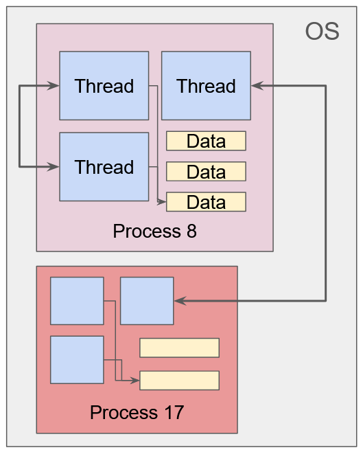
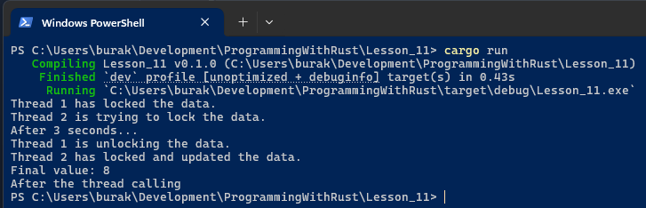

# Ders 11: Multi-Thread Programlama

İşletim sistemi tarafında bir uygulama başlatıldığında tekil bir process içerisinde bir ana iş parçacığı _(main thread)_
açılır. Bazı durumlarda program tarafından birden fazla işin eş zamanlı olarak işletilmesi gerekir. Bu durumda
genellikle yeni thread'ler oluşturulur. Birden fazla iş parçacığını aynı anda çalıştırmak performansı artırmak için
idealdir ancak çalışması karmaşıktır. Problemlerden birisi farklı thread'lerin aynı veriye erişip kullanmaya
çalışmasıdır. Thread'ler senkronize edilmediklerinde veriye tutarsız sıralarda erişebilirler. Bu genellikle **Race
Condition** olarak adlandırılan problemin oluşmasına sebebiyet verir. Bir diğer sorun iki iş parçacığının birbirinin
beklemesi durumudur ve Deadlock olarak adlandırılır. Her iki problem de eş zamanlı programlamanın _(Concurrent
Programming)_ thread kullanılan senaryolarda en çok karşımıza çıkanlar arasındadır.


_İşletim Sisteminde Process ve Thread Durumları_

## Thread Oluşturmak

Aşağıdaki kod parçasında ana thread dışında yeni bir thread daha oluşturulması ele alınmaktadır.

```rust
use std::thread;
use std::time::Duration;

fn main() {
    start_a_simple_thread();
    println!("After the thread calling");
}

pub fn start_a_simple_thread() {
    let handle = thread::spawn(move || {
        println!("Starting thread...");
        thread::sleep(Duration::new(3, 0));
        println!("Thread stopped...");
    });
    handle.join().unwrap();
}
```

Bir thread oluşturmak için spawn metodu kullanılır. Bu metot FnOnce trait uygulayan herhangi bir kod bloğunu parametre
olarak alabilir. Dışırdan thread içerisine alınacak değişkenler için move operatörü kullanılır. Ayrıca spawn metodu
geriye bir JoinHandle türü döndürür. Örnekte dikkat edileceği üzere handle üzerinden join çağrısı yapılmıştır. Bu
yapılmadığı takdirde program çalışmakta olan ikinci thread'in işleyişinin bitmesini beklemeden devam eder ve sonlanır.
Yani main thread'in, içeride başlatılan diğer thread'lerin işlerini bitirmeden sonlanmasını engellemek için JoinHandle
nesne takibini yapmak gerekir.

## move Operatörü

Spawn metodu, parametre olarak bir closure kabul eder ve bu kod bloğuna istenirse dış thread üzerinden veri taşınabilir.
Burada move operatörü ile bir bildirim yapılır. move operatörü ile ilgili durumu anlamak için aşağıdaki kod örneğini göz
önüne alalım.

```rust
use std::thread;

fn main() {
    move_keyword_error();
    println!("After the thread calling");
}

pub fn move_keyword_error() {
    let student_points = vec![30.50, 49.90, 65.55, 90.00, 81.00];
    let handle = thread::spawn(|| {
        println!("Thread is starting...");
        println!("{:?}", student_points);
        println!("Thread completed");
    });
    handle.join().unwrap();
}
```

Ana thread içinde tanımlı olan student_points vektörünün yeni başlatılan bir thread içerisinde kullanılması
örnekleniyor. Eğer move operatörünü kullanmazsak derleyici şöyle bir hata mesajı verecektir.

```text
error[E0373]: closure may outlive the current function
, but it borrows `student_points`, which is owned by the current function
```

Sorun, ana thread'in sahiplendiği bir referans türünün haricen açılmış bir thread'in işlettiği closure'a ödünç verilmeye
çalışılmasıdır. Dolayısıyla move keyword'ünü kullanarak derleyici bu konuda bilgilendirmek ve yaşam süresinin
ayarlanmasını sağlamak gerekir. İlginç olan bir durum ise, bu vektörün elemanlarının bir for döngüsü ile ela alınması
halidir. Konuyu daha iyi anlamak için kodu aşağıdaki şekilde değiştirelim.

```rust
use std::thread;

fn main() {
    move_keyword_error();
    println!("After the thread calling");
}

pub fn move_keyword_error() {
    let student_points = vec![30.50, 49.90, 65.55, 90.00, 81.00];
    let handle = thread::spawn(|| {
        println!("Thread is starting...");
        for point in student_points {
            println!("Processing for point {}", point);
        }
        println!("Thread completed");
    });
    handle.join().unwrap();
}
```

Vektör türü ile ifade edilen veriler bilindiği üzere heap üzerinde konuşlandırlır. main thread içinde başlatılan ikinci
thread bu vektörün sahipliğini _(ownership)_ closure ile açılan bloğa taşımak ister. Ancak ikinci thread main thread'den
daha uzun süre çalışabilir ve bu güvenli bir çalışma biçimi değildir _(Memory Safe)_ Bu yüzden rust move operatörü ile
durumun açıkla belirtilmesini bekler.

Rust **thread safe** bir ortam sağlamaya çalışır. Birden fazla thread'in aynı bellek adresine işaret
etmesi data race probleminin oluşmasına yol açabilir. **move** kullanıldığında closure ifadesi, student_points
vektörünün sahipliğini alır. Vektörün sahipliği artık ana thread'e değil, closure bloğuna aittir. Rust
thread’ler arası sahiplik sorununu bu şekilde çözer ve data race durumunun önüne geçilir.

Peki vektör elemanlarını teker teker dolaştığımızda **move** kullanılmaması neden bir probleme sebebiyet vermez? Bunun
nedeni closure bloğunun vektörün kendisini değil elemanlarını kullanmasıdır. Zira bu örnekte vektör elemanları boyutu
belli olan primitive tiplerden **f32** türündendir ve dolayısıyla closure ifadesine kopyalanarak taşınabilirler. Bir
başka deyişle closure bu kopyalanan veriler üzerinde çalışır ki orjinal vektörün sahiplenilmesi veya borç
olara alınması söz konusu olmaz.

Kurguya daha işe yarar bir senaryo haline getirelim. Bir sayı dizisindeki elemanların faktöryel değerlerini örneğin 4
farklı iş parçacığında ele almaya çalışalım. Aşağıdaki örnek kod parçasında bu durum ele alınmaktadır.

```rust
use std::thread;

fn main() {
    multiple_threads_sample();
    println!("After the thread calling");
}

fn calc_factorial(n: u64) -> u64 {
    (1..=n).product()
}
pub fn multiple_threads_sample() {
    let numbers = vec![10, 3, 5, 13, 8, 9, 1, 2, 17, 11, 7, 6];
    let threads_count = 4;
    let mut handles = vec![];
    let chunk_size = numbers.len() / threads_count;

    for i in 0..threads_count {
        let chunk = numbers[i * chunk_size..(i + 1) * chunk_size].to_vec();
        handles.push(thread::spawn(move || {
            let mut results = vec![];
            for num in chunk {
                println!("Thread {} processing for {}", i, num);
                results.push((num, calc_factorial(num)));
            }
            results
        }));
    }

    let mut final_results = vec![];

    for handle in handles {
        final_results.push(handle.join().unwrap());
    }

    println!("{:?}", final_results);
}
```

Numbers isimli vektörün 12 elemanı bulunmaktadır. **threads_count** değişkeni ile belirtilen sayı kadar **thread**
açılır ki örneğimize göre ana thread haricinde 4 farklı thred açılması söz konusudur. Sayı dizisindeki elemanları dört
parçaya bölünür ve her blok açılan thread'lerden birisine işlenmek üzere gönderilir. Birden fazla thread söz konusu
olduğundan her birinin işini bitirmesinin beklenmesi gerekir. Bu yüzden **spawn** çağrılarındaki **JoinHandle**
nesneleri de bir vektörde toplanır ve son aşamada tamamının sonuçları üretilene kadar beklenir.

## Atomic Reference Counting

Arc türününün kullanımını anlamak için öncelikle sorunu ortaya koymamız gerekir. Aşağıdaki örnek kod parçasını göz önüne
alalım.

```rust
use std::thread;

fn main() {
    run_with_error();
    println!("After the thread calling");
}

pub fn run_with_error() {
    let data = vec![
        "Service Red: Task A",
        "Service Blue: Task B",
        "Service Green: Task C",
        "Service Alpha: Task D",
    ];

    let mut handles = vec![];
    for i in 0..2 {
        let handle = thread::spawn(move || {
            for task in &data {
                println!("Thread '{}' is processing '{}'", i, task);
            }
        });

        handles.push(handle);
    }

    for handle in handles {
        handle.join().unwrap();
    }
}
```

Bu kod derlenmeyecek ve aşağıdaki hata mesajı üretilecektir.

```text
let data = vec![
     ---- move occurs because `data` has type `Vec<&str>`, which does not implement the `Copy` trait

for i in 0..2 {
------------- inside of this loop
 let handle = thread::spawn(move || {
                            ^^^^^^^ value moved into closure here, in previous iteration of loop
     for task in &data {
                  ---- use occurs due to use in closure
```

Senaryoda data isimli vektörü kullanmak isteyen 2 farklı thread oluşturulmak istenmektedir. Sorun aynı anda birden fazla
thread'in ortak bir referansa erişmeye çalışmasıdır zira data değişkeninin içeriği closure ifadesi içerisinde
alındığında sahiplikte bu bloğa geçer. Dolayısıyla Rust'ın sahiplik ilkeleri gereği thread safe bir ortamın sağlanması
için bu referans veri başka bir thread tarafından kullanılamaz. Çözüm olarak Arc türünden yararlanılabilir. Aşağıdaki
kod örneğinde bu kullanıma yer verilmektedir.

```rust
use std::sync::Arc;
use std::thread;

fn main() {
    run_correctly();
    println!("After the thread calling");
}

pub fn run_correctly() {
    let data = Arc::new(vec![
        "Service Red: Task A",
        "Service Blue: Task B",
        "Service Green: Task C",
        "Service Alpha: Task D",
    ]);

    let mut handles = vec![];

    for i in 0..2 {
        let data_clone = Arc::clone(&data);
        let handle = thread::spawn(move || {
            for task in data_clone.iter() {
                println!("Thread '{}' is processing '{}'", i, task);
            }
        });

        handles.push(handle);
    }

    for handle in handles {
        handle.join().unwrap();
    }
}
```

Bir önceki örnekten farklı olarak data isimli değişken oluşturulurken vektörün kendisi yeni bir atomik referans sayacına
devredilir. İkinci önemli nokta thread açılmadan önce herbir thread bloğuna bu Arc referansının bir klonunun
atanmasıdır. clone metodu çağırılırken data değişkeninin referansının verildiğine de dikkat edilmelidir. Böylece data
değişkenin işaret ettiği veriye her thread güvenli bir şekilde erişir, Arc söz konusu referans klonlarını sayar ve drop
sırasında da bunları sondan başa doğru kaldırır. Ne var ki thread'lerin veriye güvenli erişimi söz konusu olsa da bazı
senaryolarda verinin tutarlılığının bozulma ihtimali vardır.

Şimdiki senaryoda thread'lerin aynı veri üzerinde değişiklik yapmak istediğiniz düşünelim. Bu amaçla koduuzu biraz
değiştirip aşağıdaki hale getirelim.

```rust
use std::sync::Arc;
use std::thread;

fn main() {
    run_inconsistent();
    println!("After the thread calling");
}

pub fn run_inconsistent() {
    let data = Arc::new(vec![0; 10]);
    let mut handles = vec![];

    for i in 0..4 {
        let data_clone = Arc::clone(&data);
        let handle = thread::spawn(move || {
            for j in 0..data_clone.len() {
                data_clone[j] += 2;
                println!("Thread {} updating index {}", i, j);
            }
        });

        handles.push(handle);
    }

    for handle in handles {
        handle.join().unwrap();
    }

    println!("{:?}", *data);
}
```

Bu kod parçası da derlenmeyecek ve aşağıdaki hatayı üretecektir.

```text
error[E0596]: cannot borrow data in an `Arc` as mutable                                                                                                          
  --> Lesson_11\src\main.rs:17:17
   |
17 |                 data_clone[j] += 2;
   |                 ^^^^^^^^^^ cannot borrow as mutable
   |
   = help: trait `DerefMut` is required to modify through a dereference, but it is not implemented for `Arc<Vec<i32>>`
```

Arc referansının klonu alınarak üzerinde değişiklik yapılmak istenmektedir ancak Arc veriye eş zamanlı olarak güvenli
erişim sağlarken onun mutable olmasına izin vermez. Bir başka deyişle veriye eş zamanlı erişim Arc kullanımı ile
mümkünken güvenli bir şekilde değiştirilmesi için farklı bir metodoloji kullanmamız gerekir. Buna istinaden aşağıdaki
örneği göz önüne alabiliriz.

```rust
use std::sync::{Arc, Mutex};
use std::thread;
use std::time::Duration;

fn main() {
    run_mutex();
    println!("After the thread calling");
}

pub fn run_mutex() {
    let data = Arc::new(Mutex::new(0));

    let data_clone_one = Arc::clone(&data);
    let t1 = thread::spawn(move || {
        let mut num = data_clone_one.lock().unwrap();
        *num += 3;
        println!("Thread 1 has locked the data.");
        thread::sleep(Duration::from_secs(3)); // Kasıtlı olarak bekletme yapıyoruz
        println!("After 3 seconds...\nThread 1 is unlocking the data.");
    });

    let data_clone_two = Arc::clone(&data);
    let t2 = thread::spawn(move || {
        println!("Thread 2 is trying to lock the data.");
        let mut num = data_clone_two.lock().unwrap();
        *num += 5;
        println!("Thread 2 has locked and updated the data.");
    });

    t1.join().unwrap();
    t2.join().unwrap();

    println!("Final value: {}", *data.lock().unwrap());
}
```

Değiştirilmek istenen veri öncelikle bir **Mutex** nesnesinin koruması altına bırakılır ve **Arc** smart pointer'ı ile
ilişkilendirilir. Buna göre farklı thread'ler söz konusu veriye güvenli erişebilir ama değiştirmek istediklerinde bir
kilit mekanizması koyarak diğer thread'lerin aynı veriyi değiştirmesini engeller. **Thread**'ler bir **closure** ifadesi
ile başlatıldığında kilit mekanizması bu blok içerisinde konur ve scope dışına gelindiğinde söz konusu kilit otomatik
olarak düşer. Bu nedenle yukarıdaki örnek kod parçası sorunsuz ve **thread-safe** bir şekilde çalışır. Örnek kod
parçasında gerçekten kilit mekanizmalarının çalıştığını gözlemlemek için bazı bildirimler eklenmiş ve hayali bekleme
süresi konulmuştur. Buna göre beklenen çalışma zamanı çıktısı aşağıdaki gibidir.



## Thread Poisoning

// todo@buraksenyurt Not Implemented Yet

## Concurrency vs Parallel Programming

Eş zamanlılık _(Concurrency)_ ve paralel programlama sıksık birbirlerine karıştırılırlar. **Concurrency** genel olarak
birden fazla işin aynı anda başlatılmas ve yönetilmesi olarak tanımlanır. Fakat birden fazla işin fiziksel olarak aynı
anda işletilmesi paralel programlama olarak tanımlanır. **Concurrency**, başlatılan görevlerin birbirine karışmadan
yönetilmesine odaklanırken paralel programlamada işlerin gerçekten fiziksel kaynaklar arasında bölüşülerek
hızlandırılması esastır. Dolayısıyla paralel programlama da donanım yani çekirdek sayıları öne çıkar. Görüldüğü üzere
tanımlar birbirine çok yakındır bu nedenle karıştırılmaları da doğaldır. **Concurrency** de işler sırasıyla veya
birbirine bağımlı olmadan işletilirken genellikle yardımcı bazı küfeler kullanılır. **async/await** kullanımları, *
*Future** ve **tokio** gibi kütüphaneler concurrent programlama için kullanılır. Paralel programlama çoğunlukla işletim
sistemi seviyesinde ve thread enstrümanı kullanılarak icra edilir. Rust tarafında spawn metodu basitçe thread başlatmak
için yeterlidir ancak işlemci çekirdeklerinden daha iyi yararlanabilmek için **rayon** gibi harici küfeler _(crates)_
kullanılır. Asenkron programlama verilebilecek en güzel örneklerden birisi web sunucusudur. Web sunucuları eş zamanlı
olarak gelen sayısız isteği karşılamakla yükümlüdür. Buradaki işlevsellik paralel programladan ziyade gelen taleplerin
asenkron olarak belli bir planlayıcı dahilinde birbirlerini beklemden yürütülebilmesidir. Bir başka eş zamanlı çalışma
örneği de asenkron icra edilen **I/O** işlemleridir. Paralel programlama ileri seviye hesaplamalar gereken süreçlerde
veya büyük verilerin işlenmesi hatta geniş dil modellerinde çok daha etkilidir.