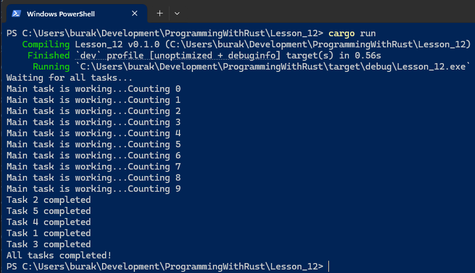
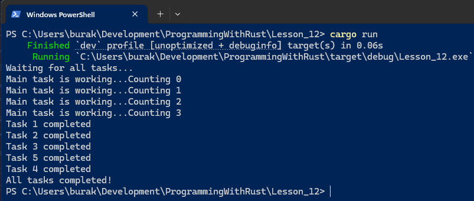

# Ders 12: Channels

Bazı durumlarda thread'ler arasında veri aktarımı gerekebilir. **Channel** enstrümanı farklı thread'ler arasında veri
taşınması için kullanılır. Rust standart kütüphanesi varsayılan olarak **Multi Producer - Single Consumer** türünü
destekler. Farklı senaryolar için **tokio**, **crossbeam** gibi küfelerden de yararlanılabilir. **MPSC** senaryosunda
producer yani veri yayımını gerçekleştiren n sayıda iş parçacığı varken tek bir tüketici ya da dinleyici söz konusudur.
Kanallar aşağıdaki örnek senaryolarda sıklıkla tercih edilir;

- Görev _(task)_ sonuçlarının ana bir **thread** içerisine toplanması
- **HTTP** isteklerinin paralel olarak işlenmesi
- Sistemde gerçekleşen olayların ana bir döngüye yönlendirilmesi
- GUI _(Graphic User Interface)_ olaylarının merkezi bir yürütücüye aktarılması
- Okuma → işleme → yazma akışının parçalanarak thread’lere dağıtılması
- Merkezi log toplayıcı yapılar

Kanallarda sahiplik _(Ownership)_ kurallarına uygunluk vardır. Veri gönderildiğinde, alıcı taraf bunu **recv()** veya
**iter()** fonksiyonları ile alır. Sahiplik göndericiden devralınır. Asenkron ve senkron uyarlamaları yazmak mümkündür.
**Tokio** veya **async-std** gibi asenkron çalışma ortamları için artık bir standart haline gelmiş olan **tokio::sync::
mpsc** küfesi kullanılır. Performans gereksinimi olan durumlarda ise **crossbeam-channel** tercih edilebilir.

## Temel Kullanım

Kanal kullanımını en basit haliyle aşağıdaki gibi ele alınabilir.

```rust
use std::sync::mpsc::channel;
use std::thread;

fn main() {
    hello_channels();
}

pub fn hello_channels() {
    let (transmitter, reciever) = channel();
    let message = String::from("Sample content");

    thread::spawn(move || {
        transmitter.send(message).unwrap();
    });

    let data = reciever.recv().unwrap();
    println!("{}", data);
}
```

Bu örnekte **spawn** metodu ile açılan **thread** içerisinde **message** değişkeninin sahip olduğu veri ana thread'de
**receiver** ile yakalanır ve ekrana basılır. **channel** çağrısı **generic Sender** ve **Receiver** veri yapılarının
generic nesne örneklerini döndürür. Buna göre transmitter _(yani Sender)_ nesnesini kullanarak bir thread içerisinde
kanala mesaj gönderimi sağlanabilir. Bu örnekte **String** türünden bir içerik gönderilmektedir. **Receiver** nesne
örneğinin **recv** fonksiyonu ile de kanala bırakılan mesaj yakalanmaktadır. **recv** fonksiyonu kanaldaki mesaj gelene
kadar çalıştığı thread'i bekletir. Örnekte dikkat edilmesi gereken noktalardan birisi de **message** değişkenini kanala
gönderdikten sonra yeniden kullanmaya çalışmaktır. Bu kullanım aşağıdaki hatanın oluşmasına sebebp olur.

```text
error[E0382]: borrow of moved value: `message`
  --> Lesson_12/src/main.rs:17:28
   |
   |     let message = String::from("Sample content");
   |         ------- move occurs because `message` has type `String`, which does not implement the `Copy` trait
   |
   |     thread::spawn(move || {
   |                   ------- value moved into closure here
   |         transmitter.send(message).unwrap();
   |                          ------- variable moved due to use in closure
...
   |     println!("{},{}", data,message);
   |                            ^^^^^^^ value borrowed here after move
   |
```

Tabii bu durum **copy** trait'i ile beslenen türler için söz konusu olmaz zira ilgili veriler kanala kopyalanarak
taşınır.

## Multi-Producer Kullanımı

Aşağıdaki örnek kod parçasında ise birden fazla gönderici ele alınmaktadır.

```rust
use std::sync::mpsc::channel;
use std::thread;
use std::time::Duration;

fn main() {
    multi_producer();
}

pub fn multi_producer() {
    let (transmitter, receiver) = channel();

    for i in 0..10 {
        let transmitter_clone = transmitter.clone();
        thread::spawn(move || {
            transmitter_clone
                .send(format!("Sending message is {}", i))
                .unwrap();
            thread::sleep(Duration::from_secs(2));
        });
    }

    drop(transmitter);

    for received in receiver {
        println!("Incoming message is '{}'", received);
    }

    println!("End of program");
}
```

Senaryoda birbirinden bağımsız çalışan 10 farklı **thread** aynı kanala mesaj bırakır. Thread'ler **spawn** çağırısı ile
ayağa kaldırılmadan önce **transmitter** nesnesinin bir klonunun oluşturulduğunda dikkat edilmelidir. Her bir **thread**
kendi **transmitter** klonunu kullanarak kanala mesaj bırakır. Mesajlar kanala senkron sırada bırakılır. İlerleyen
satırlarda bir **for** döngüsü ile kanala gelen mesajların **Receiver** nesnesi aracılığıyla yakalanması sağlanır.
Dikkat edilmesi gereken noktalardan birisi de **drop** çağrısıdır. Açık bir şekilde **transmitter** nesnesi **drop**
edilmiştir. Bu yapılmadığı takdirde **receiver**' dan mesajlar dinlenmeye devam eder ve program sonlanmaz. Zira
klonlanan receiver örnekleri halen daha aktiftir. Bazı senaryolarda bu zaten istenen bir durumdur. Farklı bir örnekle
devam edip otomatik kapanma durumunu ele alalım.

```rust
use std::sync::mpsc::channel;
use std::thread;
use std::time::Duration;

fn main() {
    multi_producer();
}

pub fn multi_producer() {
    let (transmitter, receiver) = channel();
    let transmitter_clone = transmitter.clone();

    thread::spawn(move || {
        transmitter.send(String::from("Hello there!")).unwrap();
        thread::sleep(Duration::from_secs(2));
    });

    thread::spawn(move || {
        transmitter_clone
            .send(String::from("Why are you so serious!"))
            .unwrap();
    });

    for received in receiver {
        println!("Incoming message: {}", received);
    }

    println!("End of program");
}
```

Bu örnekte **transmitter** ve **transmitter_clone** nesneleri tanımlandıkları iş parçacıkları sonlandığında bellekten
düşürülür ve dolayısıyla **receiver** üzerinden yakalanacak kanal mesajlarının sayısı bellidir. Dolayısıyla program
beklendiği şekilde tüm kanal mesajları işlendikten sonra sonlanır.

## Örnek Senaryo

Kanal kullanımları ile ilgili örnek bir senaryo ele alalım. Bu senaryoda sistemdeki n sayıda rapor dosyasının n thread
ile işlenmesi söz konusudur. Her bir **thread** ele aldığı dosyayı işledikten sonra kanala bir bilgi bırakır. Bir gerçek
hayat senaryosunda işlem sonucu, raporun ayrı bir formata çevrilmesi, farklı ağlardaki servislere gönderilmesi,
parçalanarak efektif şekilde işlenmesi gibi süreçler işletilebilir. En sonunda tüm bu bilgiler receiver üzerinden
toplanır. İlk versiyonda standart kütüphanedeki **Sender** ve **Receiver** yapıları kullanılmaktadır.

```rust
use std::sync::mpsc::channel;
use std::thread;
use std::time::Duration;

use rand::Rng;

fn main() {
    process_reports();
}

pub fn process_reports() {
    let (transmitter, receiver) = channel();

    let reports = [
        "salary.json",
        "invoices.json",
        "summary.json",
        "personnel.json",
    ];

    for report in reports {
        let transmitter = transmitter.clone();
        thread::spawn(move || {
            let mut rng = rand::thread_rng();
            let sleep_time = rng.gen_range(2..=5);
            transmitter
                .send(format!("Processing '{}' report...", report))
                .unwrap();

            // Rapor dosyalarının işlendiği bazı süreçlerin işletildiğini düşünelim

            thread::sleep(Duration::from_secs(sleep_time));

            transmitter
                .send(format!(
                    "Finished processing '{}' in {} seconds",
                    report, sleep_time
                ))
                .unwrap();
        });
    }

    drop(transmitter);
    println!("Started the processing reports");
    for result in receiver {
        println!("Status {}", result);
    }
    println!("Completed the processing reports");
}
```

Her dosya sıralı şekilde döngüye girer ve herbirisi için ayrı bir **thread** açılır. Bu thread'lerde dosyalar ile
ilgili farklı iş süreçlerinin işletildiğini düşünebiliriz. Dosya işleyişlerinin farklı sürelerde gerçekleştiğini simüle
etmek için **rand** küfesi ile üretilen rastgele sürelerde duraksatmalar yapılır.

## Asenkronluk

Rust'ın **MPSC** modülü aslında gerçek anlamda bir asenkronluk sağlamaz. **Sender** nesnesi üzerinden iletilen mesajlar
asenkron olarak yönlendirilse de **Receiver** tarafı bunları senkron olarak işler. Tam bir asenkron çalışma
sağlayabilmek için yardımcı küfelerden _(crates)_ yararlanılabilir. Aşağıdaki ilk senaryoda ana iş parçacığının
bloklanmasına neden olacak şekilde kasıtlı bir döngü kullanımı söz konusudur. Döngünün on defa işleyişini tamamlaması
gerekir.

```rust
use std::sync::mpsc::channel;
use std::thread;
use std::time::Duration;

fn main() {
    do_with_standard();
}

pub fn do_with_standard() {
    let (transmitter, receiver) = channel();

    for i in 1..=5 {
        let tx_clone = transmitter.clone();
        thread::spawn(move || {
            thread::sleep(Duration::from_secs(5));
            tx_clone.send(format!("Task {} completed", i)).unwrap();
        });
    }

    drop(transmitter);

    println!("Waiting for all tasks...");

    // Aşağıdaki döngü main thread içerisinde çalışıp akışı bloklamaya neden olur
    for i in 0..10 {
        thread::sleep(Duration::from_secs(1));
        println!("Main task is working...Counting {}", i);
    }

    while let Ok(message) = receiver.recv() {
        println!("{}", message);
    }

    println!("All tasks completed!");
}
```



Aynı örneği **tokio** küfesini kullanarak ele alalım. Bu sefer ana **thread**'i bloklayan for döngüsünü de asenkron bir
task olarak başlatalım. Buna göre receiver tarafının ilgili mesajları asenkron olarak yakalaması beklenir. **tokio**
küfesini kullanmak için projeye **Full feature** seti ile eklenmesi gerekmektedir.

```bash
 cargo add tokio -F full
 ```

Örnek kod;

 ```rust
use std::time::Duration;
use tokio::sync::mpsc;

#[tokio::main]
pub async fn main() {
    do_with_tokio().await;
}

pub async fn do_with_tokio() {
    let (transmitter, mut receiver) = mpsc::channel(10);

    for i in 1..=5 {
        let tx_clone = transmitter.clone();
        tokio::spawn(async move {
            tokio::time::sleep(Duration::from_secs(5)).await;
            tx_clone
                .send(format!("Task {} completed", i))
                .await
                .unwrap();
        });
    }

    drop(transmitter);

    println!("Waiting for all tasks...");

    /*
       Standart mpsc örneğinden farklı olarak burada ana thread bloklanmadan
       döngünün asenkron olarak çalıştırılması sağlanır.
    */
    tokio::spawn(async {
        for i in 0..10 {
            tokio::time::sleep(Duration::from_secs(1)).await;
            println!("Main task is working...Counting {}", i);
        }
    });

    while let Some(message) = receiver.recv().await {
        println!("{}", message);
    }

    println!("All tasks completed!");
}
```


