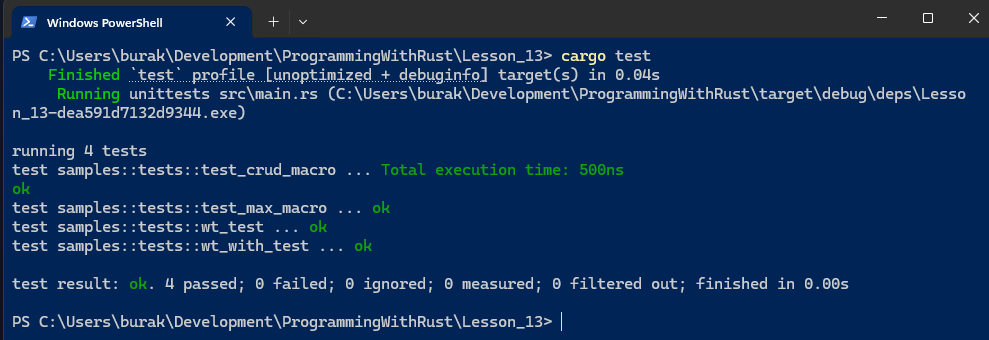
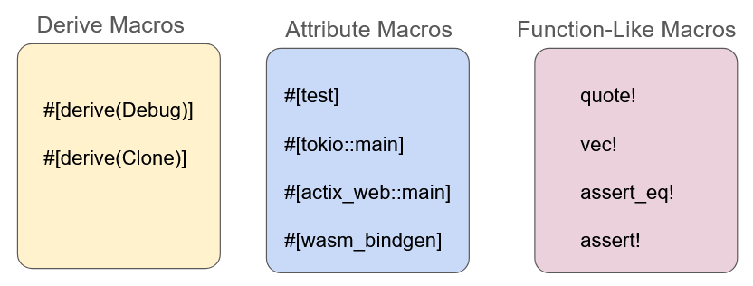

# Ders 13: Macros

Makrolar meta programlamanın temel unsurlarındadır. Meta programlama kod yazan kodlar oluşturulmasını benimseyen bir
yaklaşımdır. Makroları kullanarak kod tekrarını azaltabilir ve daha okunabilir kodların oluşturulmasını sağlayabiliriz.
Makrolar ile delerme zamanında kaynak kod üzerinde manipülasyon da yapılabilir. Ayrıca struct, enum, fn gibi yapıların
derleme zamanında analiz edilip yeni kodların üretilmesini de sağlayabiliriz. Bugüne kadarki örneklerimizde bir çok
makro kullandık. println!, write!, vec! gibi sonu ! ile biten enstrümanlar aslında birer makrodur. Makroları Declarative
_(Bildirime dayalı)_ ve Procedural _(Yönergelere dayalı)_ olmak üzere iki ana kategoriye ayırabiliriz.

## Hello Macro _(Declarative)_

Makrolar belli bir fonksiyonelliğin farklı türevlerinin yazmaktan kaçınmamızı da sağlar. Aşağıdaki basit fonksiyonu göz
önüne alalım.

```rust
pub fn max_of_two(a: i32, b: i32) -> i32 {
    if a >= b {
        return a;
    }
    b
}

#[cfg(test)]
mod tests {
    use super::*;

    #[test]
    fn test_max_of_two() {
        assert_eq!(max_of_two(10, 20), 20);
        assert_eq!(max_of_two(30, 20), 30);
    }
}
```

max_of_two fonksiyonu iki integer değerden hangisi büyükse onu geriye döndürmek amacıyla tasarlanmıştır. Ancak n adet
sayının birbiriyle karşılaştırılmasını istediğimiz bir durumda ne yaparız? Bu genellikle yeni bir fonksiyon yazılmasını
gerektirecektir. Bunun yerine bir makro hazırlayıp, sum_of fonksiyon bloğunun gelen koşullara göre üretilmesini de
sağlayabiliriz.

```rust
macro_rules! max_of {
    ($x:expr) => {
        $x
    };
    ($x:expr,$y:expr) => {
        if $x > $y {
            $x
        } else {
            $y
        }
    };
    ($x:expr,$($y:expr),+) => {
        max_of!($x,max_of!($($y),+))
    }
}

#[cfg(test)]
mod tests {
    #[test]
    fn test_max_macro() {
        assert_eq!(max_of!(1), 1);
        assert_eq!(max_of!(2, 7), 7);
        assert_eq!(max_of!(10, 0, 6, 19, 20, 3, 2, 7), 20);
        assert_eq!(max_of!(-8, -5, -3, -99), -3);
    }
}
```

Declarative yani bildirime dayalı makrolar yazmak için macro_rules isimli başka bir makro kullanılır. Kendi yazdığımız
makrolar dahil isimlendirmelerde fonksiyon adı ! işareti ile sonlandırılır. Örnekte bazı özel kalıpları kullanılmıştır.

- ($x:expr) => { $x } : Tek bir argüman ile çalışılacağını belirtir. expr ile bir expression türü ifade edilir.
  Dolayısıyla makronun uygulandığı yapıda tek bir sayısal ifade varsa doğrudan döndüren bir kod bloğu üretilecektir.
- ($x:expr, $y:expr) => { ... } : Bu kısımda ise iki argümanla eşleşilen durumu ele alır. Burada if kullanılan bir kod
  bloğunun üretimi sağlanır.
- ($x:expr, $($y:expr),+) => { ... } : Bu kalıpsa iki veya daha fazla argüman için geçerlidir. İkinci söz diziminde yer
  alan + operaötörü en az bir veya daha fazla anlamındadır. Bu durumla karşılaşılması halinde recursive olarak kendisini
  çağıran bir fonksiyon kodu üretilecektir.

## MetaSyntactic Variables

Makrolarda ifadeleri analiz etmek ve eşleşmeleri yakalamak için token'lar kullanılır. Bunlardan en çok kullanılanlar
aşağıdaki tabloda belirtilmektedir.

| Token     | Açıklama                                                              | Örnek                                             |
|-----------|-----------------------------------------------------------------------|---------------------------------------------------|
| `ident`   | Değişken, fonksiyon, struct adı gibi tanımlayıcıyıları temsil edir    | `User`, `my_function`, `x`                        |
| `ty`      | Belirli bir türü temsil eder _(örneğin, `f32`, `String`, `Vec<i32>`)_ | `f32`, `String`, `Option<T>`                      |
| `expr`    | Bir expression anlamına gelir.                                        | `5 + 4`, `"hello world"`, `vec![1, 2, 3, 4, 10]`  |
| `stmt`    | Bir ifade ya da bildirim anlamına gelir.                              | `let range = 50;`, `return 3.14;`                 |
| `path`    | Modül ya da tür yolu için kullanılır                                  | `std::io::Read`, `crate::module::function`        |
| `literal` | Sabit değer anlamına gelir (string, sayı, boolean).                   | `23`, `"rustacean"`, `false`                      |
| `block`   | `{}` bloğunu temsil eder.                                             | `{ let x = 10; x + 1 }`                           |
| `item`    | struct, enum, fn gibi enstrümanları temsil eder.                      | `struct Product;`, `fn send_email() {}`           |
| `meta`    | Bir attribute' u temsil eder.                                         | `#[derive(Debug)]`, `#[cfg(target_os = "linux")]` |
| `tt`      | Herhangi bir "token tree" ağacını temsil eder.                        | Herhangi bir Rust kodu parçası olabilir           |

## Örnekler

Aşağıdaki kod parçalarında farklı senaryoların ele alındığı procedural makrolar yer almaktadır. İlk örnek bir model
nesnesi için gerekli struct'ı kolayca oluşturmak için kullanılır.

```rust
macro_rules! crud {
    ($struct_name:ident, $($field_name:ident: $field_type:ty),*) => {
        #[derive(Debug)]
        struct $struct_name {
            $(
                $field_name: $field_type,
            )*
        }

        impl $struct_name {
            fn new($($field_name: $field_type),*) -> $struct_name {
                $struct_name { $($field_name),* }
            }
        }
    };
}

crud!(Product, id: i32,title: String,list_price:f32,category: String);

#[cfg(test)]
mod tests {
    use super::*;
    #[test]
    fn test_crud_macro() {
        let c64 = Product::new(
            1,
            "C64 monitor 14.1inch".to_string(),
            999.99,
            "Retro Computer".to_string(),
        );
        assert_eq!(c64.id, 1);
        assert_eq!(c64.title, "C64 monitor 14.1inch".to_string());
        assert_eq!(c64.list_price, 999.99);
        assert_eq!(c64.category, "Retro Computer".to_string());
    }
}
```

Örneğin Product, Customer, Order, Category ve benzeri entity nesnelerinin yer aldığı bir senaryoda her birisi için ayrı
ayrı struct geliştirmek yerine bir makro ile kod tekrarlarının önüne geçebilir, veri yapılarını basitçe
tanımlayabiliriz. crud isimli makro argüman olarak gelen identifier ve type bilgilerini kullanarak struct'ın temel
halini inşa eder ve aynı zamanda new metodunu otomatik olarak implemente eder.

Sıradaki örnek makro bir kod bloğunun çalışma süresini ölçümlemekte kullanılır.

```rust
macro_rules! wt {
    ($block:block) => {{
        let start = std::time::Instant::now();
        let result = $block;
        let duration = start.elapsed();
        println!("Total execution time: {:?}", duration);
        result
    }};
}

#[cfg(test)]
mod tests {
    use super::*;

    #[test]
    fn wt_test() {
        let sum = wt!({
        let mut total = 0;
        for i in 1..100 {
            total += i;
        }
        total
    });
        assert_eq!(sum, 4950);
    }
}
```

Örnekteki makro $block ifadesi ile aslında bir kod bloğunu ele alır. Bu bloğun öncesine bir sayaç yerleştirir ve son
olarak da çıktıyı terminal ekranına basar. println! kullanımı demo ve öğrenim senaryoları için yeterlidir ancak makronun
bir kütüphane üzerinden kullanıma açışması söz konusu olacaksa terminal bağımsız çalışan kısacası stdout üzerinden çıktı
veren bir hale getirilmesi daha doğru olur. Bu, makronun biraz daha farklı yazılmasını gerektirebilir. Aşağıdaki kod
parçasında bu durum ele alınmaktadır.

```rust
macro_rules! wt_with {
    ($writer:expr, $block:block) => {{
        use std::io::Write;
        let start = std::time::Instant::now();
        let result = $block;
        let duration = start.elapsed();
        writeln!($writer, "Total execution time: {:?}", duration).unwrap();
        result
    }};
}

#[cfg(test)]
mod tests {
    use super::*;

    #[test]
    fn wt_with_test() {
        let sum = wt_with!(std::io::stdout(), {
            let mut total = 0;
            for i in 1..100 {
                total += i;
            }
            total
        });
        assert_eq!(sum, 4950);
    }
}
```

Makroya parametre atandığına dikkat edilmelidir. Bu bir nevi writeln! çağrısının hangi ortama yapılacağının
soyutlanmasıdır. Test metodundaki gibi stdout verilmesi, bilginin terminaldeki test çıktısına yansıtılmasını sağlar.



Dolayısıyla çıktının writeln! makrosunu kullanabilen bir logger'a, network stream'a veya bir veritabanına aktarılması da
mümkündür. _(Bu durum C#, Java gibi dillerdeki bileşen bağımlılıklarının metotlar üzerinden enjekte edilerek
kullanılmasına da benzetilebilir. Daha detaylı bilgi için Dependency Injection konusuna bakılabilir)_

Devam eden örnekte ise kod bloğu içerisinde gönderilen bir veri yapısının XML çıktısını hazırlayan kodların yazıldığı
bir makro söz konusudur.

```rust
macro_rules! wt_with {
    ($writer:expr, $block:block) => {{
        use std::io::Write;
        let start = std::time::Instant::now();
        let result = $block;
        let duration = start.elapsed();
        writeln!($writer, "Total execution time: {:?}", duration).unwrap();
        result
    }};
}

#[cfg(test)]
mod tests {
    use super::*;

    #[test]
    fn xml_test() {
        let data = xml! {
        game {
            id:1,
            title:"Pacman 1983",
            rate:9.6
        }
    };
        assert_eq!(
            data,
            "<game id=\"1\" title=\"Pacman 1983\" rate=\"9.6\" />".to_string()
        );
    }
}
```

## Procedural Macros

Procedural makrolar bir Rust kodundan yararlanarak başka bir rust kodu üretilmesinde sıklıkla kullanılır. TokenStream
girdileri ile çalışır. Temelde üç türü vardır. Derive direktifi ile kullanılanlar, attribute olarak kullanılanlar ve
fonksiyon stilinde kullanılanlar.



Declarative makrolar ile aralarında bazı farklılıklar da vardır. Bunlar aşağıdaki tabloda özetlenmiştir.

| Özellik                  | Declarative Macros (`macro_rules!`)                    | Procedural Macros                                             |
|--------------------------|--------------------------------------------------------|---------------------------------------------------------------|
| **Kullanım Zorluğu**     | Basit, hızlı öğrenilir                                 | Daha karmaşıktır ve öğrenmesi zaman alır                      |
| **Kod Genişletme**       | Pattern matching ile belirgin genişletme sağlar        | Kod analizi ile daha karmaşık işlemler yapılabilir            |
| **Hata Mesajları**       | Derleyici hatalarının anlaşılması zor olabilir         | Daha karmaşık hatalar üretir                                  |
| **Performans**           | Çok hızlıdır, compile-time'da minimal etkisi vardır    | Derleme süresinin artmasına neden olabilir                    |
| **Karmaşıklık Yönetimi** | Büyük ve karmaşık işleri yönetmek zordur               | Büyük projelerde karmaşıklığın daha iyi yönetilmesini sağlar  |
| **Kapsam**               | Kod tekrarını azaltma veya basit DSL'ler için idealdir | Gelişmiş DSL'ler, derive ve attribute işlevleri için idealdir |

Procedural Macro'lar, proc-macro crate olarak adlandırılan ayrı bir kütüphanede yazılırlar. Rust söz dizimi üzerinde
TokenStream kullanılarak işlem yapılması bazı durumlarda zorlayıcı olabilir. syn ve quote gibi küfeler genellikle işi
kolaylaştıran enstrümanlar içerirler.

## Örnek Procedural Macro

Öncelikle bir kütüphane oluşturulmalıdır.

```bash
cargo new --lib procs

# Yardımcı küfeler
cargo add quote
cargo add syn -F full
```

Ardından toml dosyasında bu küfenin bir procedural macro olarak ele alınması gerektiği bildirilir.

```toml
[lib]
proc-macro = true
```

Aşağıda kodun çalışma zamanının ölçen bir işlevselliğin procedural macro olarak nasıl yazılabileceği örneklenmektedir.

```rust
extern crate proc_macro;
use proc_macro::TokenStream;
use quote::quote;
use syn::{ItemFn, parse_macro_input};

#[proc_macro_attribute]
pub fn work_time_effort(_attr: TokenStream, item: TokenStream) -> TokenStream {
    let input = parse_macro_input!(item as ItemFn);
    let fn_name = &input.sig.ident;
    let fn_block = &input.block;

    let expanded = quote! {
        fn #fn_name() {
            let start = std::time::Instant::now();
            #fn_block
            let duration = start.elapsed();
            println!("Total execution time {}: {:?}", stringify!(#fn_name), duration);
        }
    };

    expanded.into()
}
```

İlgili makro parametre olarak TokenStream'ler alır. Özellikle item değişkeni kod içerisinde kullanılır. item değişkeni
ile gelen TokenStream parse_macro_input! makrosu kullanılarak içeriği ele alınabilir bir türe dönüştürülür. Buradan
hareketle makronun uygulandığı metodun adı ve gövdesi yakalanbilir.

İlerleyen adımda quote! makrosu ile yeni bir fonksiyon hazırlanır. Dikkat edileceği üzere gelen fonksiyon bloğunun
öncesine ve sonrasına yeni kod parçaları eklenmektedir. Makro çıktı olarak üretilen yeni kod parçasını yine bir
TokenStream olarak dışarı verir.

Bu makro herhangibir metot için aşağıdaki gibi kullanılabilir.

```rust
mod samples;

use procs::work_time_effort;

#[work_time_effort]
fn find_total() {
    let mut total = 0;
    for i in 0..1000 {
        total += i;
    }
    println!("Result: {}", total);
}

fn main() {
    let _total = find_total();
}
```

Bir procedural macro küfesini kullanmak için ilgili projeye dependency olarak bildirilmesi gerekir. Bunun için toml
dosyasındaki ilgili kısım değiştirilmelidir. Örneğin,

```toml
[dependencies]
procs = { path = "../procs" }
```
